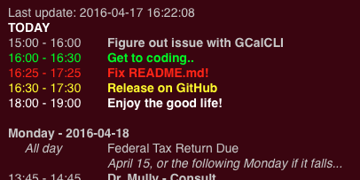

# Geeklets-GoogleCalendar
Geeklet for using displaying Google Calendar info. By using GCalCLI to access your Google Calendar, it prepares a text file which can then be displayed with GeekTools. I desgined this for work, so it shows the next few days. If it is a Friday, then it will also show the entire next week of appointments. It will show about 45 characters of the description if there is one.

It works best with a grey text since the script highlights events different colors:

*	Green if the event is happening now
*	Red if the event will happen withing 5 minutes
*	Yellow if the event will happen in about 15 minutes
*	White if the event has not happened yet today.

## Setup
1. Fastest way is to install **PIP**, if not already done. You should be able to do `sudo easy_install pip` from Terminal
2. Now install GCalCLI with `sudo pip install gcalcli`
3. Currently (April 2016) when running GCalCLI, there will be Python warnings because of refactoring in the newest version. Figured this out with [GCalCLI issue #237](https://github.com/insanum/gcalcli/issues/237). When setting up on a new system I had to do downgrade Google API Python Client and the OAuth2 Client with the following:
	1. Uninstall the Google API Python Client with `sudo -H pip uninstall google-api-python-client`
	2. Install V 1.4.2 `sudo -H pip install google-api-python-client==1.4.2`
	3. Uninstall OAuth2 Client with `sudo -H pip uninstall oauth2client`
	4. Install V 1.4.12 with `sudo -H pip install oauth2client==1.4.12`

## Test
Try running `gcalcli agenda` from Terminal. This should cause the authentication process to start and a browser window should open. You'll see that gcalcli wants to connect to your Google account. Once you accept it should create a file in your home directory named *.gcalcli_oauth*.

*Note:* If there is an error writing the ~/.gcalcli_oauth file, you may need to fix permissions on the httplib2 library: `sudo chmod o+r -R /Library/Python/2.7/site-packages/httplib2-0.9.2-py2.7.egg`
 
## Usage
1. Copy the *Calender.py* somewhere to your drive, I put them in `~/Documents/Geeklets/`
2. Create a Shell Geeklet and set the command to `python ~/Documents/Geeklets/Calendar.py` or where ever you put your script. I set the refresh to about 3 minutes.
3. Create a new Shell Geeklet and set the command to `more /private/tmp/Geeklet-calendar.txt`. Set the text color to a light grey and set the refresh to about 3 minutes.

